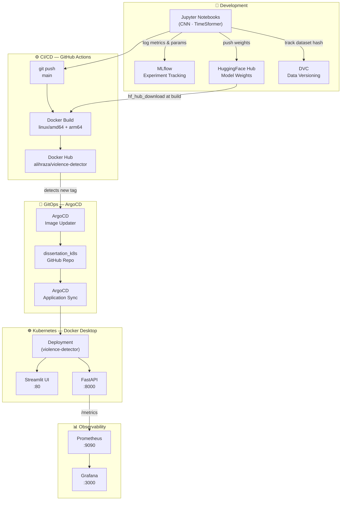

# Violence Detection — MLOps Pipeline

[](https://github.com/alihraza099/lsbu_dissertation/actions/workflows/docker-image.yml)
[](https://hub.docker.com/r/alihraza/violence-detector)
[](https://huggingface.co/alihraza/violence-detector)
[](http://localhost:5001)
[](https://kubernetes.io)

Real-time binary video classification (Violence / NonViolence) with a full end-to-end MLOps pipeline — experiment tracking, REST inference API, live observability, GitOps deployment, and reproducible data versioning.

---

## Architecture



---

## Models

| Model | Architecture | Val Accuracy | Params | Input | Training |
|-------|-------------|:------------:|-------:|-------|---------|
| **TimeSformer** *(prod)* | `facebook/timesformer-base-finetuned-k400` fine-tuned | **99.50%** | 121M | 8 × 224² | 2-phase: head-only → full fine-tune, early stopped ep. 11 |
| CNN Baseline | ResNet-18 + temporal avg-pool | 98.17% | 11M | 16 × 64² | Single phase, early stopped ep. 24 |

Both trained on the [Real Life Violence Situations Dataset](https://www.kaggle.com/datasets/mohamedmustafa/real-life-violence-situations-dataset) — 4,000 videos, balanced binary labels.

---

## MLOps Stack

| Layer | Tool | Purpose |
|-------|------|---------|
| Experiment tracking | MLflow 2.17.2 | Metrics, params, model lineage across runs |
| Data versioning | DVC | Dataset hash locked in Git — fully reproducible |
| Model storage | HuggingFace Hub | Versioned weight hosting (463 MB) |
| REST inference API | FastAPI + Uvicorn | `/predict`, `/health`, `/metrics` endpoints |
| Observability | Prometheus + Grafana | Latency, confidence, prediction rate dashboards |
| Containerisation | Docker (multi-platform) | `linux/amd64` + `linux/arm64` |
| CI/CD | GitHub Actions | Auto-build & push on every relevant commit |
| Container registry | Docker Hub | Image distribution |
| Orchestration | Kubernetes (Docker Desktop) | Deployment + LoadBalancer service |
| GitOps | ArgoCD | Declarative sync from Git |
| Auto-rollout | ArgoCD Image Updater | Zero-touch deploy on new image tag |

---

## REST API

The FastAPI endpoint runs on port 8000 alongside the Streamlit UI.

### Predict
```bash
curl -X POST http://localhost:8000/predict \
  -F "file=@video.mp4"
```
```json
{
  "prediction": "Violence",
  "confidence": 0.9998,
  "probabilities": { "NonViolence": 0.0002, "Violence": 0.9998 },
  "latency_seconds": 4.2
}
```

### Other endpoints
```bash
curl http://localhost:8000/health   # liveness probe
curl http://localhost:8000/metrics  # Prometheus scrape
```

Interactive docs: **http://localhost:8000/docs**

---

## Observability

Prometheus scrapes `/metrics` every 15 seconds. The Grafana dashboard is pre-provisioned on first boot.

```bash
docker compose -f docker-compose.monitoring.yml up -d
```

| Service | URL | Credentials |
|---------|-----|-------------|
| Prometheus | http://localhost:9090 | — |
| Grafana | http://localhost:3000 | admin / admin |

**Dashboard panels:** Model Status · Total Predictions · P95 Latency · Avg Confidence · Prediction Rate by Class · Latency Percentiles (p50/p95/p99) · Confidence over Time · Violence/NonViolence ratio

**Key metrics exposed:**

| Metric | Type | Description |
|--------|------|-------------|
| `inference_latency_seconds` | Histogram | End-to-end request latency |
| `prediction_confidence` | Histogram | Confidence score by predicted class |
| `predictions_total` | Counter | Cumulative predictions by class |
| `model_loaded` | Gauge | 1 when model is ready |

---

## Results

### TimeSformer — Two-Phase Fine-Tuning

| Phase | Epochs | Best Val Acc |
|-------|--------|:-----------:|
| Phase 1 — head only | 5 | 99.17% |
| Phase 2 — full fine-tune | 11 *(early stopped)* | **99.50%** |

### CNN — ResNet-18 Baseline

| Epochs | Best Val Acc | Early Stop |
|--------|:-----------:|-----------|
| 24 / 50 | **98.17%** | Patience 10 |

Both runs tracked in MLflow — open http://localhost:5001 to compare metrics side-by-side.

---

## Deployment Flow

1. **Train** — run `Dissertation_Transformers.ipynb` or `cnn.ipynb`; metrics auto-log to MLflow
2. **Push** — `git push origin main` triggers GitHub Actions
3. **Build** — multi-platform Docker image built; model weights pulled from HuggingFace at build time
4. **Ship** — ArgoCD Image Updater detects new Docker Hub tag → patches `deployment.yaml` → ArgoCD syncs Kubernetes — no manual `kubectl` needed
5. **Observe** — Prometheus scrapes `/metrics` from the running pod; Grafana shows live inference stats

---

## Quick Start

### Run locally
```bash
git clone https://github.com/alihraza099/lsbu_dissertation.git
cd lsbu_dissertation
pip install -r requirements.txt
# Streamlit UI
streamlit run app.py
# FastAPI (separate terminal)
uvicorn api:app --port 8000
```

### Run via Docker
```bash
docker run -p 8501:8501 -p 8000:8000 alihraza/violence-detector:latest
# Streamlit → http://localhost:8501
# FastAPI   → http://localhost:8000/docs
```

### Start MLflow
```bash
docker run -d --name mlflow-server \
  -p 5001:5000 -v mlflow-data:/mlflow \
  ghcr.io/mlflow/mlflow:v2.17.2 \
  mlflow server --host=0.0.0.0 --port=5000 \
    --backend-store-uri=sqlite:///mlflow/mlflow.db \
    --default-artifact-root=/mlflow/artifacts
# open http://localhost:5001
```

### Start Prometheus + Grafana
```bash
docker compose -f docker-compose.monitoring.yml up -d
# Grafana → http://localhost:3000  (admin / admin)
```

---

## Repository Layout

```
.
├── app.py                            # Streamlit inference UI
├── api.py                            # FastAPI REST endpoint + Prometheus metrics
├── model.py                          # Shared inference logic (used by both)
├── start.sh                          # Container entrypoint (uvicorn + streamlit)
├── Dissertation_Transformers.ipynb   # TimeSformer training + MLflow logging
├── cnn.ipynb                         # ResNet-18 CNN training + MLflow logging
├── video_preprocessing.ipynb         # Frame extraction & dataset preparation
├── preprocessed_data.dvc             # DVC-tracked dataset pointer
├── requirements.txt                  # Runtime dependencies
├── Dockerfile                        # Multi-platform image (pulls weights from HF)
├── deployment.yaml                   # Kubernetes Deployment + Service
├── docker-compose.monitoring.yml     # Prometheus + Grafana stack
├── monitoring/
│   ├── prometheus.yml                # Scrape config
│   └── grafana/provisioning/         # Auto-provisioned datasource + dashboard
└── .github/workflows/
    └── docker-image.yml              # CI/CD pipeline
```

---

## About

MSc dissertation project — London South Bank University, 2026.
**"Implement an incremental development approach in MLOps for a computer vision pipeline."**

Author: Ali Raza · [LinkedIn](https://linkedin.com/in/) · [alihraza/violence-detector on HuggingFace](https://huggingface.co/alihraza/violence-detector)
